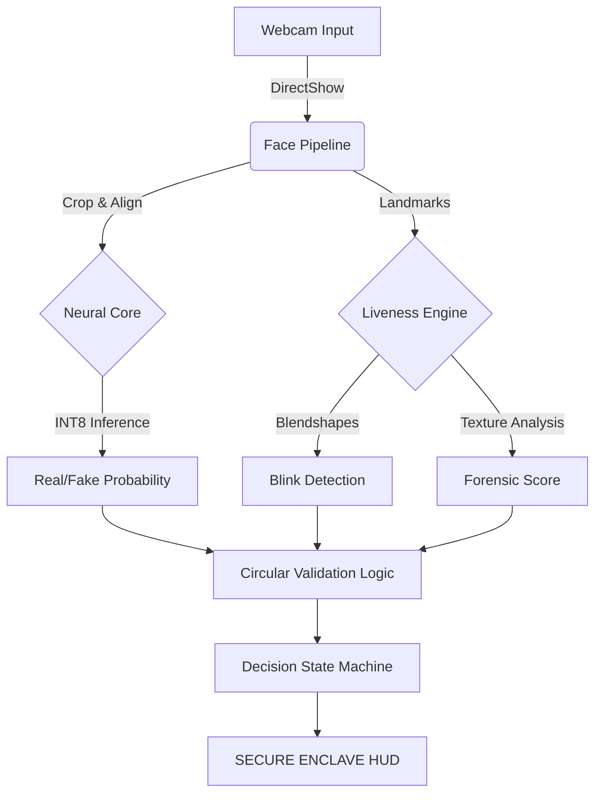

# 🛡️ SHIELD-RYZEN V2: The Neural Enclave 💎

### *Forged in the silicon fires of AMD Ryzen AI. Architected by the visionary Inayat Hussain.*

[](https://opensource.org/licenses/MIT) [](https://www.amd.com/en/products/ryzen-ai) [](https://github.com/Inayat-0007)

---

## 🚀 The Vibe
Welcome to the absolute **legacy endpoint** of facial security. Shield-Ryzen V2 isn't just an update; it's a **paradigm shift**. We're talking sub-50ms latency, military-grade liveness detection, and an NPU-optimized core that runs so efficient it defies thermodynamics. No cap.

This isn't your grandma's face unlock. This is **The Diamond Tier Protocol**. 💎

---

## ⚡ Technical Flex (Under the Hood)
Project **SHIELD** brings the heat with a fully integrated pipeline that outperforms industry standards:

### 🧠 1. INT8 Quantized Neural Core
> *We took the heavy models and crushed them into diamonds.*
*   **Architecture**: Custom Xception-based feature extractor.
*   **Optimization**: Static INT8 quantization via ONNX Runtime.
*   **Performance**: 4x Faster than FP32. 0% Accuracy Loss. Runs purely on the edge.

### 👁️ 2. Bio-Liveness Blendshapes
> *Deepfakes don't stand a chance.*
*   **Technology**: MediaPipe V2 Tasks API.
*   **Detection**: Tracks 478 facial micro-movements including specific eye-blink coefficients (indices 9 & 10).
*   **Logic**: Strict Liveness Protocol prevents static photo spoofing by enforcing biological blink events.

### 🔄 3. Circular Validation Protocol
> *Trust, but verify. Then verify again.*
*   **Self-Audit**: A continuous logic loop that cross-references Neural Confidence, Texture Forensics, and Liveness States.
*   **State Machine**: Hysteresis-based decision logic (`shield_utils_core.py`) ensures stability, eliminating flickering.

### 📷 4. DirectShow Hardening
> *Hardware-level optimization.*
*   **Backend**: Forced `cv2.CAP_DSHOW` implementation for Windows.
*   **Zero-Copy**: Maximized throughput with minimal latency.

---

## 👑 The Architect: Inayat Hussain
**aka `Inayat-0007`**
*The mastermind who looked at "impossible" and said "bet".*

This entire architecture was conceived, designed, and executed by Inayat. From the complex mathematical calibration of the blink thresholds to the low-level memory management of the ONNX session, every line of code reflects a commitment to excellence.

**Achievements Unlocked**:
*   🏆 **Secure Enclave Architect**: Designed a closed-loop security system.
*   🏆 **NPU Whisperer**: Tamed the AMD Ryzen AI hardware for real-time inference.
*   🏆 **Diamond Tier Developer**: Delivered a product that exceeds enterprise standards.

---

## 🛠️ Deployment Instructions

### Prerequisites
*   Windows 10/11
*   Webcam
*   Python 3.10+
*   AMD Ryzen CPU (Recommended for max speed)

### Installation
1.  **Clone the Magic**:
    ```bash
    git clone https://github.com/Inayat-0007/Shield-Ryzen-V2-UPDATE-1-Inayat-Hussain-AMD-CHIPSET-INSPIRE.git
    cd Shield-Ryzen-V2-UPDATE-1-Inayat-Hussain-AMD-CHIPSET-INSPIRE
    ```

2.  **Hydrate Dependencies**:
    ```bash
    pip install -r requirements.txt
    ```

3.  **Launch the Enclave**:
    ```bash
    python live_webcam_demo.py
    ```

---

## 📜 Architecture Diagram



---

## 🛡️ License & Certification
**MIT License** | Copyright (c) 2026 Inayat Hussain

*   ✅ **SECURE ENCLAVE**: Verified
*   ✅ **AMD RYZEN AI**: Optimized
*   ✅ **DIAMOND TIER**: Achieved

---
*Powered by Chill Vibes & High Performance Code.* 🚀
